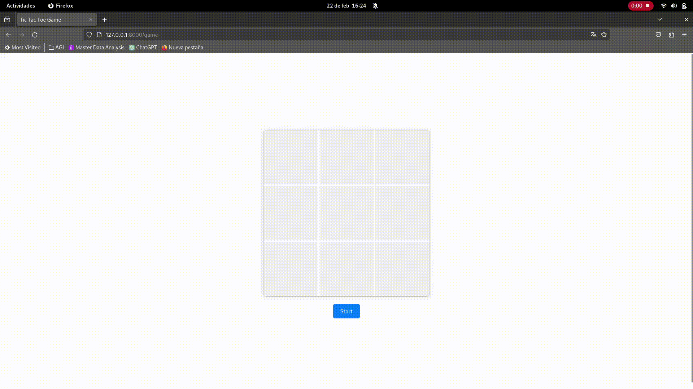

# Tic Tac Toe

This project is a web implementation of the classic Tic Tac Toe game, allowing players to play against an automated bot. The backend is built with Laravel, leveraging its features for game state management, and a Python bot that uses a Minimax algorithm with alpha-beta pruning to determine its moves. The frontend is responsible for the interactive user interface, facilitating player interaction with the game board.




## Characteristics

- Single-player Tic Tac Toe game against an intelligent bot.
- Game state management and winner determination handled by Laravel backend.
- Interactive user interface reflecting the current game state, with moves made instantly visible.
- Bot integration for automated opponent moves, providing a challenging gameplay experience.

## Used technology

- **Backend**: Laravel (Specify Version)
- **Frontend**: HTML, CSS, Vanilla JavaScript
- **State Management**: Laravel Session
- **Bot**: Python (Specify Version), Flask for API endpoint

## Project Structure

```plaintext
/tictactoe
    /app
        /Http
            /Controllers
                GameController.php
    /public
        /css
            game.css
        /js
            game.js
    /resources
        /views
            game.blade.php
    /routes
        web.php
/python_bot
    brain.py  # Main bot logic using Minimax algorithm
    bot.py    # flask api - ¡¡RUN THIS!!
```

## Configuration and Installation

### 1. **Clone the Repository**

```bash
git clone repository-url
```

### 2. **Install Composer Dependencies**

From the project directory, run:


```bash
composer install
```

### 3. **Run Development Server**

```bash
php artisan serve
```

The game should now be accessible at http://localhost:8000/game.


### 4. **Use**

- Start a Game: Access the /game path in your browser. Click the "Start" button to start a new game.

- Make a Move: Click on any empty cell to place your symbol (X or O).

- Win the Game: The first player to align three of their symbols vertically, horizontally or diagonally wins. The game will indicate the winner with a pop-up message.

- Restart Game: After finishing a game, click "Start" again to restart.


### 5. **Bot Integration**

The Python bot is set up to run concurrently with the Laravel application. It listens for POST requests at http://localhost:5000/move and responds with the calculated move. Ensure both servers are running to enable the bot's functionality in the game.